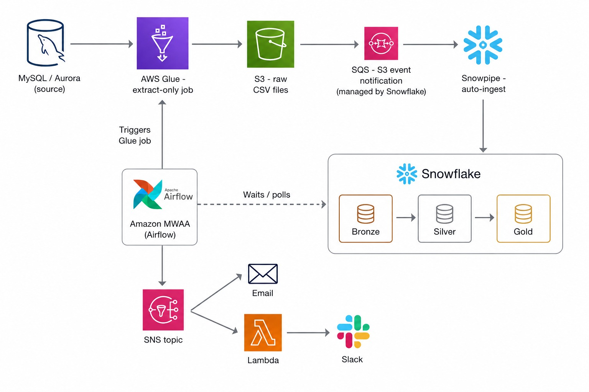

# AWS Glue + Snowflake Data Pipeline

An ELT pipeline that extracts data from a production MySQL/Aurora database,
lands it in S3, auto-ingests it into Snowflake via Snowpipe, and transforms
it through a medallion architecture (Bronze/Silver/Gold) using dbt. The
whole flow is orchestrated by Airflow (Amazon MWAA in production, Docker
locally), fully defined as infrastructure-as-code with Terraform, and
deployed through a CI/CD pipeline in GitHub Actions.

Failures anywhere in the pipeline trigger real-time alerts to email and
Slack via SNS.



## Why this architecture

The original transformation logic lived inside a Glue/Spark job, mixing
extraction and business logic in one place — expensive to run, hard to
test, and impossible to version cleanly. This project re-architects that
into an ELT pattern: **Glue only extracts**, all transformation logic
moves into dbt (versioned, tested, and reviewable in pull requests), and
Snowflake's compute handles the heavy lifting instead of Spark.

**Design principles followed throughout:**

- **No hardcoded time windows.** The classic anti-pattern this project
  deliberately avoids: a pipeline that waits a fixed number of hours and
  hopes the data is there by then. Every wait is a sensor that checks
  real state (a Snowflake row count, a Glue job status) instead of
  guessing a duration.
- **Everything is code-reviewed and version-controlled.** No manual
  changes in the AWS console for anything Terraform can manage.
  Deployments go through `repo → PR → pipeline`, never a manual click.
- **Cost-consciousness is a first-class concern.** Two warehouses in
  Snowflake so ETL and BI queries never compete for compute. MWAA is
  provisioned only when actively tested and destroyed immediately after
  (see [Cost warning](#cost-warning) below) rather than left running.
- **Ownership over data gaps, not just pipeline health.** A pipeline
  that resumes after a failure but leaves a hole in the data is only
  half fixed — see [Known issues](#known-issues-found-in-production)
  for a real example of this found during development.

## Architecture

| Component | Role |
|---|---|
| **AWS Glue** | Extracts raw data from MySQL/Aurora. No business logic — pure extract, timestamped CSV to S3. |
| **Amazon S3** | Landing zone for raw extracts. Bucket notifications trigger ingestion. |
| **Snowpipe** | Auto-ingests new S3 files into Snowflake `RAW`, triggered via an S3 → SQS event (the SQS queue is managed internally by Snowflake when `AUTO_INGEST = TRUE`). |
| **Snowflake** | Medallion architecture: `RAW` → `BRONZE` (typed) → `SILVER` (deduplicated, business logic via dbt) → `GOLD` (dimensional models for BI). Two warehouses separate ETL compute from analytics compute. |
| **dbt** | All transformation logic: incremental models, SCD2 snapshots, and 12+ tests (uniqueness, referential integrity, business rules like flagging underage users). |
| **Airflow (MWAA / local Docker)** | Orchestrates the pipeline: triggers Glue, waits for Glue completion, waits for Snowpipe to actually load data (via a `SqlSensor`, not a fixed sleep), then runs `dbt run` / `dbt test` / `dbt snapshot`. |
| **Terraform** | Manages all infrastructure that changes infrequently: Glue job, S3 buckets/notifications, SQS, Snowflake databases/schemas/warehouses/integrations, IAM, MWAA, SNS, and the Slack-alerting Lambda. Never manages Snowflake tables, stages, or pipes — those are dbt/SQL's domain. |
| **GitHub Actions** | Two-stage CI/CD: `ci-validate` runs `terraform plan` + `dbt run/test` against dev on every push (including the `dev` branch); `cd-deploy` runs `terraform apply` + `dbt run/test/snapshot` against prod, only on a push to `main`. |
| **SNS + Lambda** | Any Airflow task failure (after retries are exhausted) publishes to an SNS topic, which fans out to an email subscription and a Lambda that posts to a Slack webhook. |

## Failure alerting

The DAG's `default_args` includes an `on_failure_callback` that fires once
per failed task, after Airflow's own retries are exhausted. It publishes
a structured message (DAG, task, execution date, error, log link) to a
single SNS topic — the DAG itself has no knowledge of *where* alerts end
up, which means adding a new channel (PagerDuty, SMS) later is a matter of
adding an SNS subscription, not touching pipeline code.

```
Airflow task fails (after retries)
        │
        ▼
   SNS topic (player-pipeline-alerts)
        │
        ├──► Email subscription
        │
        └──► Lambda ──► Slack incoming webhook
```

The Lambda reads the Slack webhook URL from AWS Secrets Manager at
runtime — it is never hardcoded or passed as a plain environment variable,
and never committed to this repo.

### Dead letter queue: two distinct failure modes

While testing alert delivery, a subtle distinction surfaced that is worth
documenting: SNS-to-Lambda subscriptions have two separate DLQ
mechanisms, each catching a different kind of failure.

- `redrive_policy` on the SNS subscription catches delivery failures --
  cases where SNS could not invoke the Lambda at all (permissions,
  throttling). It does not catch failures where the Lambda was
  successfully invoked but then threw an exception during its own
  execution.
- `dead_letter_config` on the Lambda function itself catches execution
  failures -- exceptions raised inside the function's code after
  Lambda's own automatic async-invoke retries (2 by default) are
  exhausted.

This was confirmed empirically: breaking the Slack webhook on purpose
produced three Lambda invocations (visible in CloudWatch Logs, same
request ID, each throwing HTTPError: HTTP Error 404), none of which
reached the SNS-level DLQ -- because SNS successfully invoked the Lambda
every time. Only after adding dead_letter_config to the Lambda itself
did the failed message correctly land in the DLQ
(pipeline-alert-slack-dlq).

Both mechanisms point to the same SQS queue in this project for
simplicity; a larger system might separate them to distinguish which
failure mode produced a given message. Messages in the DLQ are retained
for a limited period (SQS default/max retention), so it is an
operational tool for near-term inspection and reprocessing, not a
permanent audit log -- CloudWatch Logs with explicit retention, or an
export to S3/a table, would be the right place for that.

## Known issues found in production

Two real bugs were found and documented (rather than silently fixed) while
building this project, because both are directly relevant to how a
production pipeline should be evaluated:

**1. Fixed 24-hour extraction window (Glue job).** The extraction script
computes `fecha_inicio = fecha_fin - timedelta(hours=24)` on every run —
always relative to "now", never to the last successful extraction. Running
the job multiple times in the same afternoon during testing produced
hundreds of duplicate rows in `RAW` (deduplicated correctly downstream by
Silver, so the final data was unaffected, but the inefficiency and
brittleness are real). Left as a known, documented issue rather than
patched, since it is a deliberate discussion point: the fix is to track
the last extracted timestamp (a control table, an SSM parameter, or a
`MAX(created_date)` lookup against Snowflake) instead of a fixed window.

**2. Snowpipe sensor uses a 10-minute fixed window.** The `SqlSensor`
that waits for Snowpipe to finish loading checks
`_loaded_at > dateadd('minute', -10, current_timestamp())` — functionally
the same anti-pattern as issue #1, just one layer up. It works reliably
in practice, but is fragile if the DAG runs twice within 10 minutes or if
Snowpipe is delayed under heavy load. The correct fix (designed, not yet
implemented): pass the exact file name Glue generated to the sensor via
XCom, so it checks for that specific file's arrival instead of a time
window.

## Cost warning

`aws_mwaa_environment` bills continuously (~$0.49/hour for `mw1.small`)
from the moment it's created until it's destroyed — there is no
auto-suspend. Only apply this resource when actively testing, and destroy
it immediately after:

```bash
cd terraform
terraform destroy -target=aws_mwaa_environment.player_pipeline
```

## Repository structure

```
.
├── terraform/              # All infrastructure as code
│   ├── mwaa.tf              # Airflow environment (MWAA)
│   ├── sns.tf                # Alerting topic + email subscription
│   ├── slack_alerts.tf     # Lambda + Slack webhook subscription
│   └── ...
├── lambda/
│   └── slack_alert/
│       └── handler.py      # Reformats SNS messages and posts to Slack
├── airflow/
│   └── dags/
│       └── player_data_pipeline.py
├── snowflake_dbt_medallion/ # dbt project: models, tests, snapshots
├── glue_scripts/
│   └── func_player_raw.py  # Extract-only Glue job
└── .github/workflows/
    └── ci_cd.yml
```

## CI/CD flow

```
push to dev  ──► ci-validate (terraform plan + dbt run/test vs dev)
                        │
                   PR to main
                        │
              manual merge to main
                        │
push to main ──► ci-validate ──► cd-deploy (terraform apply + dbt run/test/snapshot vs prod)
```

`cd-deploy` never runs on a pull request — only on a direct push to `main`,
after `ci-validate` has already passed — so unmerged code never touches
real infrastructure.